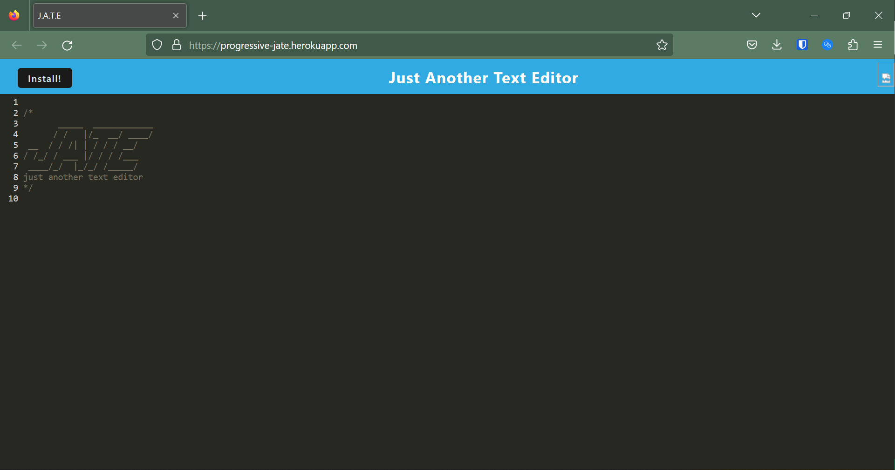

# 19 Progressive Text Exitor

## Table of Contents

- [Project Description](#project-description)
- [Visuals](#visuals)
- [Installation Instructions](#installation-instructions)
- [Usage Instructions](#usage-instructions)
- [Contributing](#contributing)
- [Authors and Acknowledgment](#authors-and-acknowledgment)
- [License](#license)
- [Project Status](#project-status)

## Project Description
This project is a web based text editor that can save the state of the editor between different sessions

## Visuals
 
 

## Installation Instructions
Go to https://progressive-jate.herokuapp.com/ to visit the app on the web.
to self host, pull the project from https://progressive-jate.herokuapp.com/
and run the command '''npm run start''' to start the application locally

## Usage Instructions
This text editor allows the user to enter text, close the app, and revisit the app at a later time and view their previous data.

## Contributing
Brent Keller

## Authors and Acknowledgment
Author: Brent Keller

## License
None

## Project Status
In work